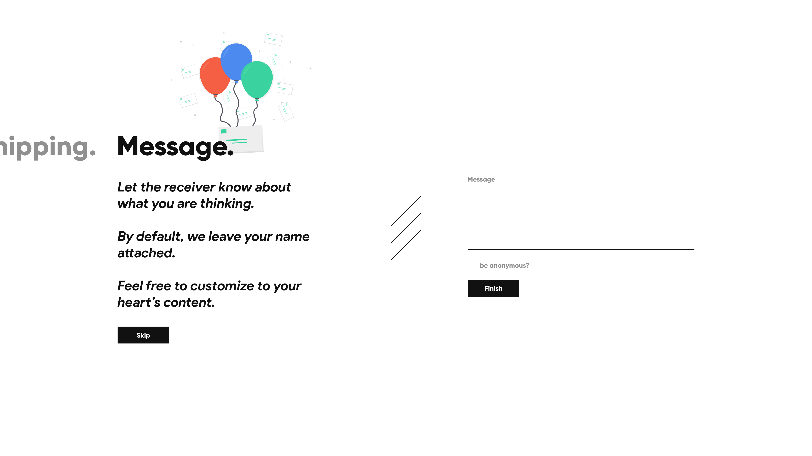

# Hello Shopify,

### General information
Thank you for taking a look at my solution.

You can view the mockup here [here](https://github.com/Wuon/Shopify/blob/master/Summer%202019/Content%20Strategy%20Intern/mock%402x.png).

Please use this for reference when I describe my thought process.

### UX
I believe that the current solution does not provide enough information for
the user. For example: 
- How does he/she know that the notes is a required option?

There is zero detail provided on whether or not it needs to be filled out, or
if it can be skipped. As such, I decided to implement a skip button. Straight away,
users will be able to identify from the form that it is not optional. Also, I have decided
to include crucial information on what the form is asking for. Are readers confused? No problem,
we have information that tells you what to do. I also decided to seperate the shipping and the message.
I personally think its confusing to combine the two. They should be two different sections
because they are two different things. I also decided to accomadate the need for anonymous senders
because sometimes people do that. I feel like removing the first name and last name forms may be a double edged
sword, since it allows for the interface to be cleaner, but at the cost of removing the option to change names.
I would like to assume that whoever is paying is giving the flowers <3 By keeping things simple and intuitive,
we allow for users to navigate properly, and instantly know what is happening without being confused
on the next step.

### UI
The message box can be easy to miss since it looks the same as all the other boxes.
I decided to add in some graphics to help give users a visualisation of what is going on.
By cleaning up the interface the importance becomes obvious. This screen is just for a message
If I need to fill one out I will, if not I'll skip it.

### Remarks
If there are any other questions, feel free to email me at: 
wuon@protonmail.com

With love and passion, 
Daniel Wu

